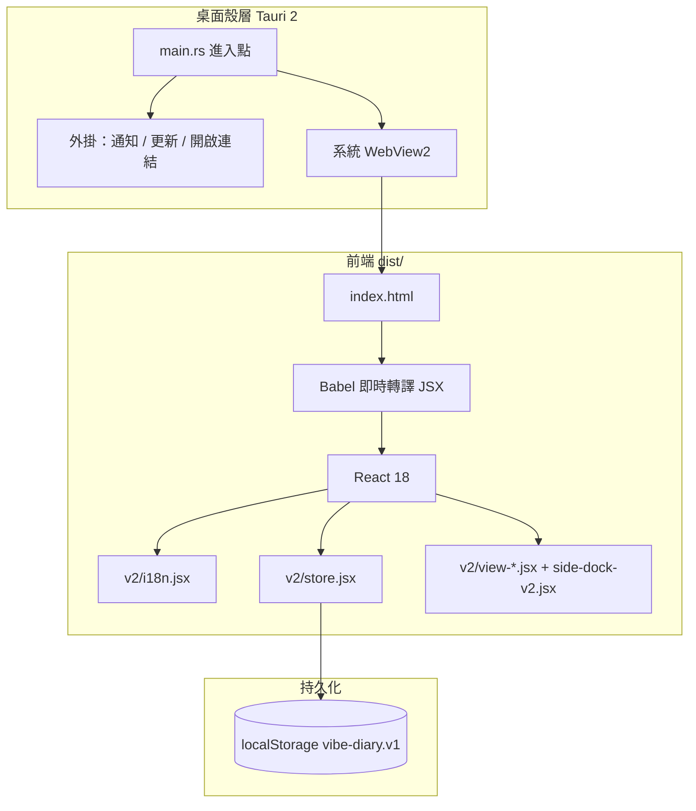

# Todotable

透明側邊欄日記與開發工作台。前端以 React 撰寫，透過 Tauri 2 封裝為 Windows `.exe`／`.msi`、macOS `.app` 等桌面安裝檔。

介面支援**繁體中文**與 **English**，於標題列 **中文 | English** 切換。預設語言為繁體中文。

---

## 目錄

1. [功能概覽](#功能概覽)
2. [系統架構](#系統架構)
3. [技術組成](#技術組成)
4. [環境需求](#環境需求)
5. [執行方式](#執行方式)
6. [打包成 exe 安裝檔](#打包成-exe-安裝檔)
7. [專案目錄](#專案目錄)
8. [資料儲存](#資料儲存)
9. [多語系與自訂](#多語系與自訂)
10. [設定參考](#設定參考)
11. [疑難排解](#疑難排解)
12. [授權與致謝](#授權與致謝)

---

## 功能概覽

| 模組 | 說明 |
|------|------|
| 待辦 | 依專案管理待辦、緊急標記、已完成清單 |
| 指令 | 儲存常用終端機指令，一鍵複製 |
| 詢問 | 貼上客戶郵件、撰寫回覆草稿、標記已回覆 |
| 日曆 | 每日工時與完成事項自動彙整、日記備註 |
| 音樂 | YouTube 播放清單背景播放 |
| 倒數日 | 專案里程碑倒數 |
| 工時 | 自動追蹤活躍工作時間 |
| 桌面模式 | 無標題列、透明背景，浮於桌面使用 |

---

## 系統架構

應用分為兩層：**桌面殼層（Tauri + Rust）** 與 **前端（HTML + React JSX）**。Tauri 建立系統 WebView 視窗並載入本地 `dist/` 內的網頁資源；前端在 WebView 中執行，資料寫入 `localStorage`。



### 啟動流程

| 步驟 | 說明 |
|------|------|
| 1 | 執行 `npm run dev` 或 `npm run build` 前，先跑 `scripts/build-dist.mjs` |
| 2 | 將 `index.html`、`styles.css`、`v2/`、`vendor/` 複製到 `dist/` |
| 3 | Tauri 啟動 Rust 程式，WebView 載入 `dist/index.html` |
| 4 | Babel 依序載入 `i18n.jsx` → `store.jsx` → 各功能模組 → `side-dock-v2.jsx` |
| 5 | React 掛載至 `#root`，狀態經 `useDiary()` 與全元件共用 |

### exe 的產生方式

一般網頁在瀏覽器分頁中執行；本專案透過 Tauri 將同一套前端包進原生程式：

1. **Rust 主程式**（`src-tauri/src/main.rs`）負責建立視窗、載入 WebView、註冊外掛。
2. **WebView2**（Windows）或各平台對應 WebView 渲染 `dist/` 內的 UI。
3. **`tauri build`** 將 Rust 執行檔、前端資源、圖示合併為安裝包。

Windows 建置完成後，主要產物位於：

```
src-tauri/target/release/bundle/
├── msi/     # Windows 安裝程式（.msi）
└── nsis/    # 或 NSIS 安裝程式（依環境與設定）
```

安裝後使用者取得的 `.exe`／`.msi` 即來自上述目錄。專案已整合 `tauri-plugin-updater`，啟動時可於背景檢查更新（需網路）。

---

## 技術組成

| 層級 | 技術 | 備註 |
|------|------|------|
| UI | React 18 + JSX | 無 Vite／Webpack；瀏覽器內 Babel 轉譯 |
| 狀態 | 自訂 pub/sub + `localStorage` | 鍵名 `vibe-diary.v1` |
| 多語系 | `v2/i18n.jsx` | `zh-TW`、`en` |
| 桌面殼 | Tauri 2 + Rust | 體積小於 Electron，使用系統 WebView |
| 字型 | Noto Sans TC、Caveat、Space Mono | Google Fonts |

### npm 指令

| 指令 | 作用 |
|------|------|
| `npm install` | 安裝 Tauri CLI 等開發依賴 |
| `npm run dist` | 僅複製前端資源到 `dist/` |
| `npm run dev` | 建置 `dist/` 後啟動 Tauri 開發視窗 |
| `npm run build` | 建置 `dist/` 後產出正式安裝包 |
| `npm run tauri` | 直接呼叫 Tauri CLI（進階用法） |

---

## 環境需求

### 瀏覽器預覽

- [Node.js](https://nodejs.org/) 18 或以上

### 桌面開發與打包 exe

| 項目 | 說明 |
|------|------|
| Node.js | 18+，執行 npm 與 Tauri CLI |
| Rust | 透過 [rustup](https://www.rust-lang.org/tools/install) 安裝 |
| Windows | [WebView2](https://developer.microsoft.com/microsoft-edge/webview2/)（Win10 1903+ 通常已內建） |
| macOS | Xcode Command Line Tools |
| Linux | `libwebkit2gtk` 等，見 [Tauri 前置條件](https://tauri.app/start/prerequisites/) |

安裝 Rust 後請**重新開啟終端機**，並確認：

```powershell
rustc --version
cargo --version
node -v
npm -v
```

---

## 執行方式

### 方式一：瀏覽器預覽

適合快速查看 UI、調整 JSX，無需安裝 Rust。

```powershell
cd d:\...
npm install
npx --yes serve . -l 3456
```

瀏覽器開啟：

```
http://localhost:3456/index.html
```

注意事項：

- 請使用本機 HTTP 伺服器，勿以 `file://` 直接開啟 HTML，否則 `.jsx` 可能因安全限制無法載入。
- 瀏覽器預覽會顯示**假 IDE 背景**（裝飾用示意，非真實編輯器）。
- Tauri 桌面版或開啟「桌面模式（透明）」後，假 IDE 會自動隱藏。

### 方式二：Tauri 桌面版（開發模式）

適合體驗透明側邊欄、拖曳、通知等完整桌面行為。

```powershell
npm install
npm run dev
```

行為說明：

- 首次執行會編譯 Rust，耗時較長。
- 自動啟用**桌面模式**（透明、無系統標題列）。
- 修改 `v2/*.jsx` 後需手動重新整理視窗（無熱更新）。

標題列粉色區域具 `data-tauri-drag-region`，可拖曳移動視窗。

---

## 打包成 exe 安裝檔

### 建置步驟（Windows）

```powershell
# 1. 進入專案根目錄
cd d:\workingtable-0.3.0\workingtable-0.3.0

# 2. 安裝依賴（首次）
npm install

# 3. 確認 Rust 已安裝
rustc --version

# 4. 建置安裝包（會自動執行 build-dist，再編譯 Tauri）
npm run build
```

建置成功後，至以下目錄取得安裝檔：

```
src-tauri\target\release\bundle\
```

常見檔案：

| 類型 | 說明 |
|------|------|
| `.msi` | Windows 安裝程式，雙擊安裝 |
| `.exe`（NSIS） | 部分設定下會產生可執行安裝檔 |
| 未打包的 `.exe` | `src-tauri\target\release\vibe-diary.exe` 可直接執行（開發測試用） |

### 自訂應用程式圖示

```powershell
npx tauri icon src-tauri\icons\icon.png
npm run build
```

### 建置時間與體積參考

- 首次 `npm run build` 需下載並編譯 Rust 依賴，可能需十數分鐘。
- 之後增量建置較快。
- 安裝包體積通常明顯小於 Electron 同類應用（實際大小依平台與設定而異）。

---

## 專案目錄

```
workingtable-0.3.0/
├── index.html                 # 前端入口
├── styles.css                 # 全域樣式
├── tweaks-panel.jsx           # 右下角調校面板
├── vendor/                    # React、ReactDOM、Babel（離線）
├── v2/
│   ├── i18n.jsx               # 多語系字典與語言切換
│   ├── store.jsx              # 狀態、actions、localStorage
│   ├── side-dock-v2.jsx       # 主框架與側邊分頁
│   ├── view-todo.jsx          # 待辦
│   ├── view-today.jsx         # 日曆
│   ├── view-cheat.jsx         # 指令
│   ├── view-mail.jsx          # 詢問／郵件
│   ├── view-prompt.jsx        # 提示詞庫（程式已載入，主分頁未掛載）
│   ├── view-ai.jsx            # AI 書籤
│   ├── view-retro.jsx         # 回顧
│   ├── timer.jsx              # 音樂、工時、倒數日
│   ├── tracker.jsx            # 活動追蹤、收工視窗
│   ├── photocard.jsx          # 拍立得框擷圖
│   ├── ai.jsx                 # AI 輔助（需 Claude API 環境）
│   └── music.jsx                # YouTube 背景播放
├── scripts/
│   ├── build-dist.mjs         # 複製前端至 dist/
│   └── make-latest-json.mjs    # 發佈更新資訊用
├── dist/                      # 建置產物（勿手動改，由腳本產生）
├── package.json
└── src-tauri/
    ├── tauri.conf.json        # 視窗、bundle、更新設定
    ├── Cargo.toml             # Rust 依賴
    ├── capabilities/          # 權限
    └── src/main.rs            # Rust 進入點
```

`wireframes/` 為早期 UI 線框原型，正式執行不會載入。

---

## 資料儲存

所有使用者資料存於 **`localStorage`**：

| 鍵名 | 內容 |
|------|------|
| `vibe-diary.v1` | 專案、待辦、郵件、提示詞、工時、設定等完整 JSON |
| `vibe-diary.locale` | 語言偏好（`zh-TW` 或 `en`） |

儲存位置（概略）：

| 環境 | 路徑 |
|------|------|
| 瀏覽器預覽 | 該網址的 Site Local Storage |
| Tauri（Windows） | `%APPDATA%\` 下與 `app.vibe-diary` 相關的 WebView2 目錄 |

清除瀏覽器或應用儲存將重置為空白專案。大量資料建議日後改為 SQLite 或 `tauri-plugin-store`。

---

## 多語系與自訂

- 翻譯定義：`v2/i18n.jsx` 內 `MESSAGES['zh-TW']`、`MESSAGES.en`
- 元件用法：`const { t } = useI18n();` 搭配 `t('key')` 或 `t('key', { count: 3 })`
- 切換位置：標題列 **中文 | English**

新增翻譯：在兩種語言的 `MESSAGES` 加入相同 key，並於 JSX 以 `t('your.key')` 取代硬編碼字串。

---

## 設定參考

主要設定檔：`src-tauri/tauri.conf.json`

| 選項 | 目前值 | 說明 |
|------|--------|------|
| `productName` | `vibe-diary` | 應用程式名稱 |
| `identifier` | `app.vibe-diary` | 套件識別、資料目錄 |
| `decorations` | `false` | 關閉系統標題列 |
| `transparent` | `true` | 透明背景 |
| `width` × `height` | 440 × 1000 | 初始視窗大小 |
| `alwaysOnTop` | `false` | 改為 `true` 可固定置頂 |

應用顯示名稱與視窗標題另見 `v2/i18n.jsx` 的 `app.pageTitle`。

右下角 **Tweaks** 面板可調整：桌面模式、停靠左右、分頁方向、強調色。

---

## 疑難排解

| 現象 | 處理方式 |
|------|----------|
| `rustc` 找不到 | 安裝 [Rust](https://www.rust-lang.org/tools/install)，重開終端機 |
| 畫面全白或無內容 | 使用 `http://localhost` 預覽；檢查主控台錯誤；確認 `dist/` 已透過 `npm run dist` 產生 |
| 建置失敗：缺少圖示 | 執行 `npx tauri icon src-tauri/icons/icon.png` |
| AI 無法使用 | `window.claude.complete` 僅在特定環境可用；需自行修改 `v2/ai.jsx` 串接 API |
| 修改 JSX 未生效 | 重新整理視窗；桌面版執行 `npm run dev` 前會重建 `dist/` |

---

相關連結：

- [Tauri 文件](https://tauri.app/)
- [Tauri 前置條件](https://tauri.app/start/prerequisites/)
